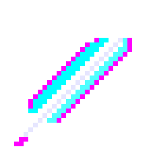
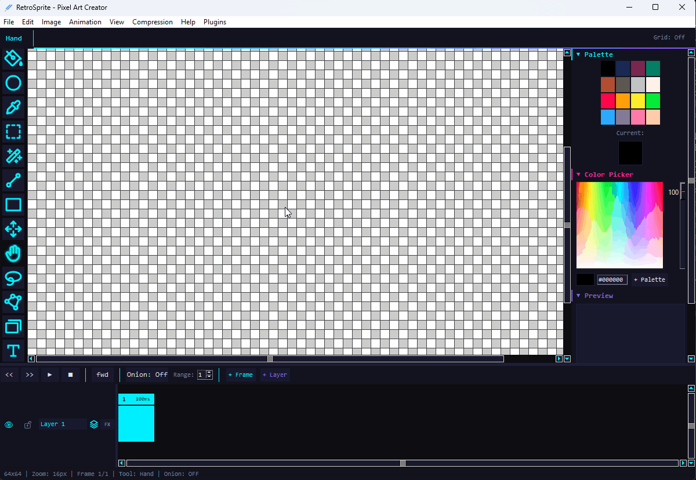
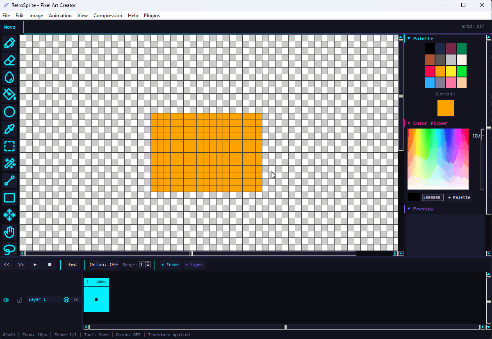
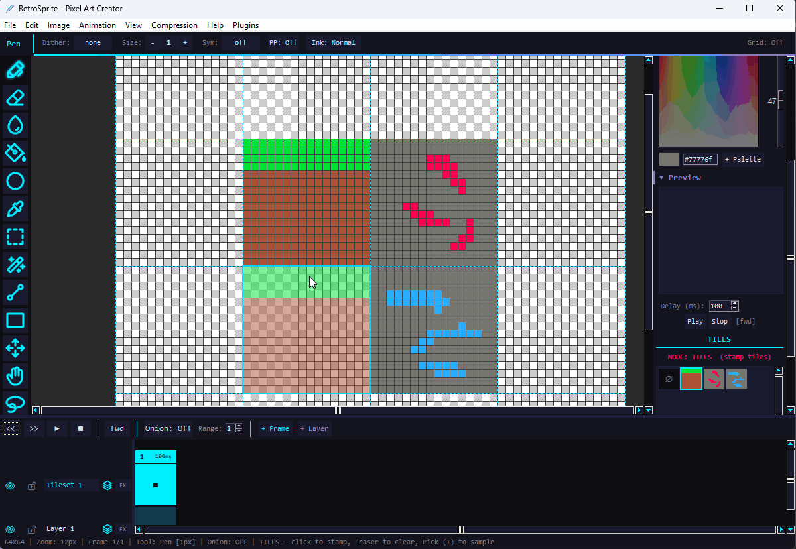
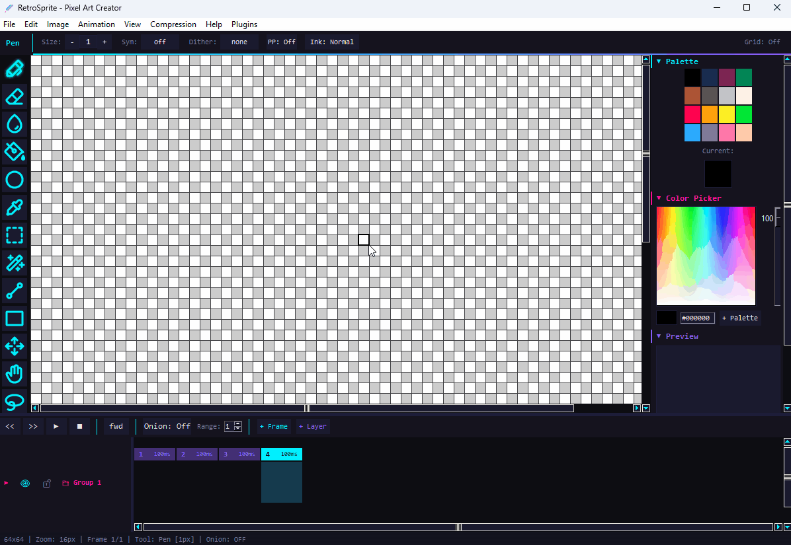
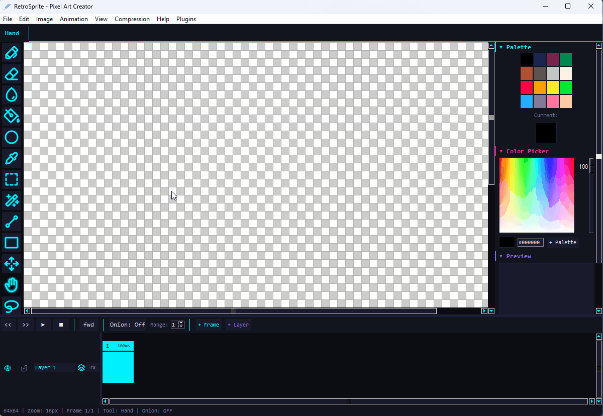
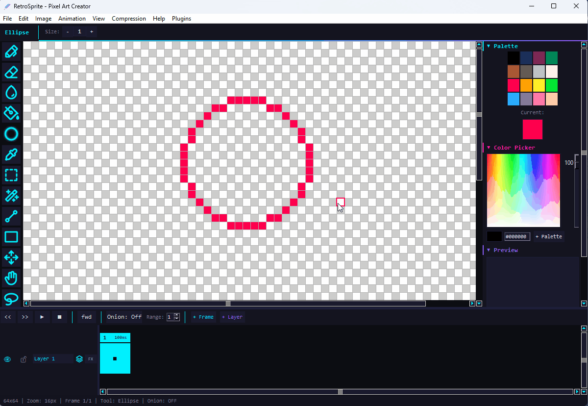
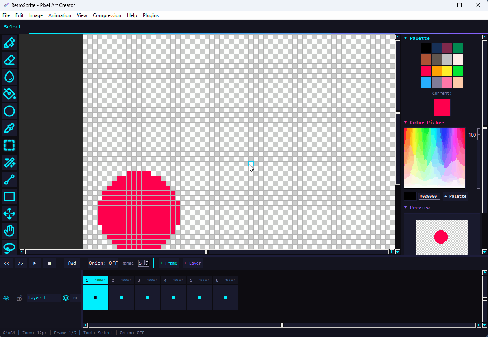
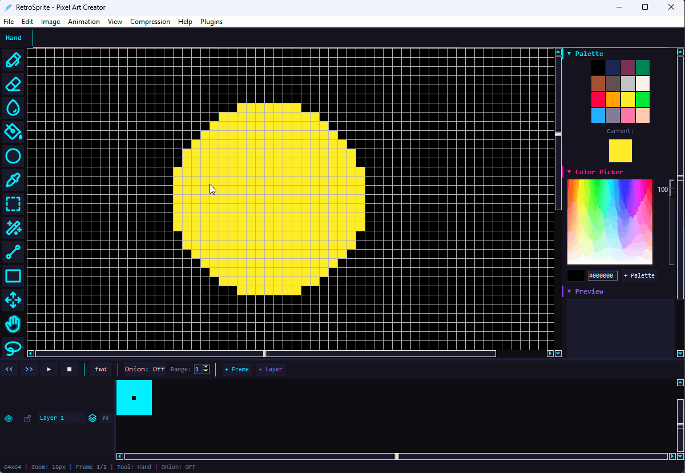

# RetroSprite

[](https://github.com/Theodor908/RetroSprite/actions/workflows/ci.yml)
[](https://github.com/Theodor908/RetroSprite/releases)
[](https://www.python.org/downloads/)
[](LICENSE)

<p align="center">
  
</p>

A lightweight pixel art editor and animation tool built with Python.

RetroSprite provides the tools to create pixel art, sprite sheets, tilemaps, and frame-by-frame animations, from a single icon to a full character animation set.



## Preview

| Selection Transform | Tilemap Editor |
|---------------------|----------------|
|  |  |

| Frame Tags & Timeline | Text Tool |
|-----------------------|-----------|
|  |  |

| Drawing | Fill Tool |
|---------|-----------|
|  |  |

| Animation | Layer Effects |
|-----------|---------------|
|  |  |

## Features

**Drawing**
- 14 tools: Pen, Eraser, Fill, Line, Rectangle, Ellipse, Polygon, Rounded Rectangle, Blur, Color Picker, Gradient Fill, Shading Ink, Move, Text
- Symmetry modes (horizontal, vertical, both) with a movable axis
- Pixel-perfect lines and dithering patterns
- Ink modes: Normal, Alpha Lock, Behind
- Tiled drawing mode for seamless textures

**Text Tool**
- Aseprite-style dialog with live canvas preview
- Built-in bitmap pixel fonts: Tiny (3x5) and Standard (5x7)
- Load custom TTF/OTF fonts with crisp 1-bit rendering
- Adjustable letter spacing and multiline support

**Selection & Transform**
- Rectangle Select, Magic Wand, Lasso, and Polygon Select
- Add, subtract, and intersect selection modes
- Custom brush capture from selection
- Selection transform (`Ctrl+T`) with rotate, scale, and skew
- Pivot repositioning and numeric transform controls
- Auto-show transform handles on paste (`Ctrl+V`)

**Grid & Snapping**
- Dual grid system: pixel grid (1x1) plus custom grid (NxM) with offset
- Independent visibility, RGBA color, and zoom threshold per grid
- Grid settings persist per project in `.retro` files
- Snap transforms, movement, paste, and text placement to the custom grid

**Layers & Animation**
- Unlimited layers with blend modes
- Layer groups for organization
- Drag-to-reorder layers in the timeline
- Opacity, lock, and visibility controls
- Non-destructive layer effects
- Frame-by-frame animation with timeline, onion skinning, and frame tags
- Playback modes: Forward, Reverse, Ping-Pong

**Color**
- Built-in palettes: Pico-8, DB16, DB32, Commodore 64, NES, and more
- Color ramp generation
- Indexed color mode with median-cut quantization
- Import/export palettes: GPL, PAL, HEX, ASE

**File Formats**
- Native `.retro` project format
- Export: PNG, GIF, WebP, APNG, sprite sheet, frame sequence
- Import: Aseprite, Photoshop PSD, GIF, APNG, animated WebP, PNG sequence, sprite sheet, and common image formats
- Reference image overlay with saved position and settings

**Extensibility**
- Plugin system for custom tools, filters, effects, and menu items
- Scripting API for batch operations
- CLI mode for headless export

**Tilemap**
- Tilemap layers with reusable tile palettes
- Pixel mode and tile mode editing
- Tile sampling directly from the canvas
- Right sidebar tiles panel with thumbnails and flip controls

## Installation

### From Source

```bash
git clone https://github.com/Theodor908/RetroSprite.git
cd RetroSprite
pip install -r requirements.txt
python main.py
```

### Requirements

- Python 3.10+
- Pillow >= 9.0
- NumPy >= 1.24
- imageio >= 2.20
- pytest >= 7.0
- Tkinter (included with most Python installations)

Optional:
- `psd-tools` for Photoshop import support
- `pyinstaller` for local desktop builds

## Project Structure

```text
RetroSprite/
|- src/               # Application logic, tools, effects, import/export, UI modules
|- tests/             # pytest suite
|- assets/            # README media, icons, and example assets
|- docs/              # Architecture, standards, roadmap, and design notes
|- requirements.txt   # Runtime and test dependencies
|- main.py            # Desktop entry point
`- RetroSprite.spec   # PyInstaller spec
```

## Usage

### GUI

```bash
python main.py
```

### CLI

```bash
python -m src.cli --help
python -m src.cli export project.retro --format gif --scale 2
python -m src.cli info project.retro
```

## Keyboard Shortcuts

### Tools

| Key | Tool |
|-----|------|
| P | Pen |
| E | Eraser |
| F | Fill |
| L | Line |
| R | Rectangle |
| O | Ellipse |
| S | Select |
| W | Magic Wand |
| I | Color Picker |
| H | Hand |
| B | Blur |
| V | Move |
| A | Lasso |
| N | Polygon |
| T | Text |
| U | Rounded Rectangle |
| M | Cycle symmetry mode |
| D | Cycle dither pattern |
| G | Toggle pixel-perfect |
| [ / ] | Shading darken / lighten |

### General

| Key | Action |
|-----|--------|
| Ctrl+Z / Ctrl+Y | Undo / Redo |
| Ctrl+C / Ctrl+V | Copy / Paste selection |
| Ctrl+X | Cut selection |
| Ctrl+Shift+E | Export dialog |
| Ctrl+S | Save project |
| Ctrl+O | Open project |
| Ctrl+R | Load / toggle reference image |
| Delete | Delete selection contents |

### Selection Transform

| Key / Action | Effect |
|--------------|--------|
| Ctrl+T | Enter transform mode |
| Drag inside | Move selection |
| Drag corner | Uniform scale |
| Shift+drag corner | Non-uniform scale |
| Ctrl+drag corner | Skew along nearest axis |
| Drag midpoint | Scale on one axis |
| Drag outside | Free rotation |
| Shift+drag outside | Rotation snapped to 15 degrees |
| Drag pivot | Reposition rotation center |
| Ctrl+drag | Snap movement to visible custom grid |
| Enter | Apply transform |
| Esc | Cancel transform |

### Grid & Symmetry

| Key | Action |
|-----|--------|
| Ctrl+G | Toggle custom grid |
| Ctrl+H | Toggle pixel grid |
| Ctrl+Shift+G | Grid settings dialog |
| Ctrl+drag | Snap transform or move to custom grid |
| Drag symmetry axis | Move axis |
| Right-click axis | Set axis position precisely |

## Plugins

Create `.py` files in `~/.retrosprite/plugins/`:

```python
PLUGIN_INFO = {"name": "My Plugin"}

def register(api):
    api.register_filter("Invert", my_invert_function)

def unregister(api):
    pass
```

See the in-app feature guide for the full scripting API reference.

## Building

```bash
pip install pyinstaller
python -m PyInstaller RetroSprite.spec --noconfirm
```

Output: `dist/RetroSprite/RetroSprite.exe`

## Testing

```bash
python -m pytest tests/
```

## Contributing

See [CONTRIBUTING.md](CONTRIBUTING.md) for development guidelines and pull request expectations.

## License

Copyright (c) 2026 Vasile Theodor Gabriel

RetroSprite is licensed under the GNU General Public License v3.0 or later. See [LICENSE](LICENSE) for details.
